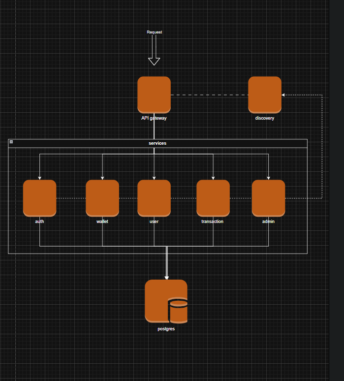

# 🚀 Flow-Fi Project

## 📋 Overview
Flow-Fi is a microservices-based application that uses **Spring Boot**, **Spring Cloud**, **Eureka**, and **API Gateway** to provide a modular and scalable architecture. The gateway automatically discovers and routes requests to services registered with Eureka—no manual route configuration needed.

---

## 🛠 Technology Stack
- **Java 17+**
- **Spring Boot** (Web, JPA, DevTools)
- **Spring Cloud Eureka** (Service Discovery)
- **Spring Cloud Gateway** (API Gateway)
- **PostgreSQL** (Database)
- **Docker & Docker Compose**
- **Maven**

---

## 📦 Services & Ports

| Service            | Port  | Description                                  |
|--------------------|-------|----------------------------------------------|
| Service Discovery  | 8761  | Eureka server for service registration/lookup|
| API Gateway        | 8080  | Routes all incoming frontend requests        |
| PostgreSQL         | 5432  | Primary database for all services            |

---

## 📛 Microservice Naming Conventions

| Type                | Naming Format                      | Example         |
|---------------------|-------------------------------------|-----------------|
| Project Directory   | kebab-case-service                  | `user-service`  |
| Docker Container    | kebab-case-service                  | `user-service`  |
| Spring App Name     | kebab-case-service (`spring.application.name`) | `user-service`  |
| Eureka ID           | Same as app name                    | `user-service`  |

---

## ➕ How to Add a New Microservice

### Step 1: Create the Spring Boot Project
- Name your project directory according to the convention (e.g., `notification-service`).
- Add dependencies: **Spring Web**, **Spring Boot DevTools**, **Spring Cloud Eureka Client**, **Spring Data JPA**, etc.
- Configure `application.properties`:
```properties
spring.application.name=notification-service
server.port=8084 # Choose an unused port
eureka.client.serviceUrl.defaultZone=http://service-discovery:8761/eureka
````

### Step 2: Create a Dockerfile

Place a `Dockerfile` in the root of your new microservice project:

```dockerfile
FROM maven:3.9.11-eclipse-temurin-17 AS build
WORKDIR /app
COPY pom.xml .
RUN mvn dependency:go-offline
COPY src ./src
RUN mvn clean package -DskipTests


FROM eclipse-temurin:17-jdk-alpine
WORKDIR /app
COPY --from=build /app/target/*.jar app.jar
EXPOSE 8761
ENTRYPOINT ["java", "-jar", "app.jar"]
```

### Step 3: Register in `docker-compose.yml`

Add your new service:

```yaml
notification-service:
  build: ./notification-service
  container_name: notification-service
  ports:
    - "8084:8084"
  depends_on:
    - service-discovery
    - postgres
  networks:
    - flownet
```

✅ **No manual API Gateway route configuration is needed**—the gateway will automatically discover your service through Eureka.

---

## ⚙️ Running the Project

### Prerequisites

* **Docker & Docker Compose**
* **Java 17+**
* **Maven**

### Local Development

```bash
# Clone repository
git clone https://github.com/bhushan-joshi/flow-fi.git
cd flow-fi

# Create PostgreSQL data directory
mkdir -p PGDATA

# Build & run all services
docker-compose up --build
```

---

## 🔗 Service URLs

Once running, access services at:

| Service                 | URL                                            |
| ----------------------- | ---------------------------------------------- |
| **Eureka Dashboard**    | [http://localhost:8761](http://localhost:8761) |
| **API Gateway**         | [http://localhost:8080](http://localhost:8080) |
| **User Service**        | `http://localhost:8080/user-service/**`        |
| **Wallet Service**      | `http://localhost:8080/wallet-service/**`      |
| **Transaction Service** | `http://localhost:8080/transaction-service/**` |

---

## 🛑 .gitignore

Ensure `.gitignore` contains:

```gitignore
# PostgreSQL data & build artifacts
/PGDATA/
/target/

# IDE files
/.idea/
/*.iml

# Log files
*.log
```

---

## 🧾 Contribution Guide

```bash
# Create a new branch
git checkout -b feature/your-new-feature

# Make your changes
# Test locally
docker-compose up --build

# Commit & push
git commit -m "Add new feature"
git push origin feature/your-new-feature
```

* Open a **Pull Request** and request a review.

---
## Architecture diagram



## 📜 License

This project is licensed under the **MIT License**.
See the [LICENSE](LICENSE) file for details.


---